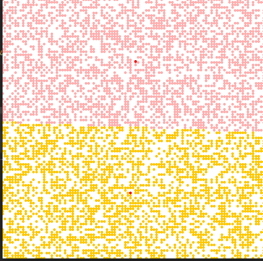
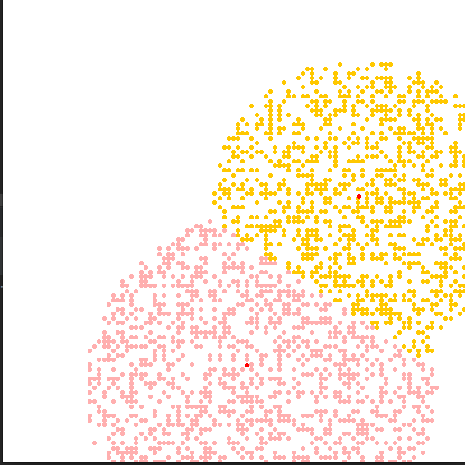
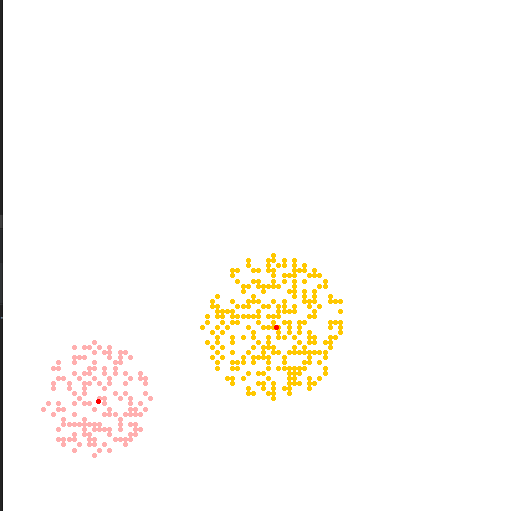
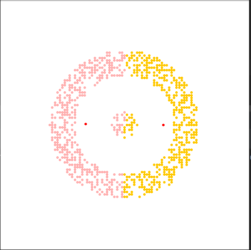

# Кластеринг k-means
### Входные данные
Случайно сгенерированные точки на плоскости
### Задача
С помощью кластеринга k-means требуется отсортировать данные
### Решение
Были использованы библиотеки scikit-learn и показались весьма полезными, оптимизирующими работу, иерархическая кластеризация показалась довольно бесполезной в моих примерах за исключением примера кольца с точкой, тут k-means - неоптимальное решение
### Анализ адекватности k-means
Пример со случайными точками на плоскости прошел безуспешно потому что k-means не предназначен для такого типа информации

Чем четче разграничены кластеры, тем соответственно лучше работает k-means

Это лучше всего видно на 3 примере

Хотя существуют и исключения, в который иерархическая кластеризация работает лучше

### Вывод
Кластеризация может довольно точно разграничить данные, но нужно подбирать ее оптимальный и оптимальные параметры, которые позволяет выбрать scikit-learn
