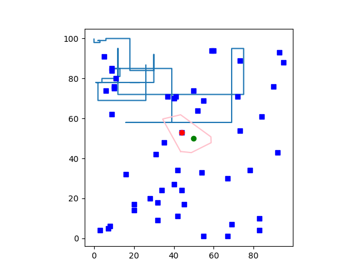
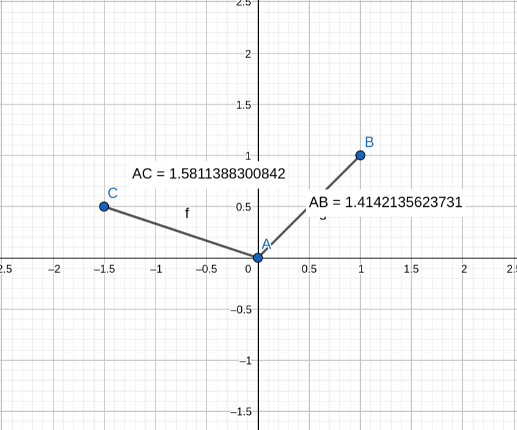

# Задача про школы
### Постановка задачи
Дан город с местоположениями входов школ и улицами. Для любой точки нужно определить школу, в которой учится житель этой точки
### Входные данные
На плоскости (100X100) случайно сгенерированы улицы в виде объекта shapely.geometry, случайно сгенерированы местоположения школ
### Метод решения
Плоскость разбивается на диаграмму Вороного, каждый многоугольник диаграммы - многоугольник shapely.geometry, проверяется в каком многоугольнике лежит соответственно данная точка и выводится школа, создающая этот многоугольник
### Пример

### Исключения
Диаграмма Вороного построена на евклидовом расстоянии, поэтому могут возникать ошибки, которые иллюстрирует данный пример, евклидово расстояние всегда меньше или равно манхеттенскому, поэтому возникают противоречие, при одинаковом манхеттенском не всегда однозначно определяется школа

### Вывод
Диаграмма Вороного - отличный инструмент для обработки геоданных
